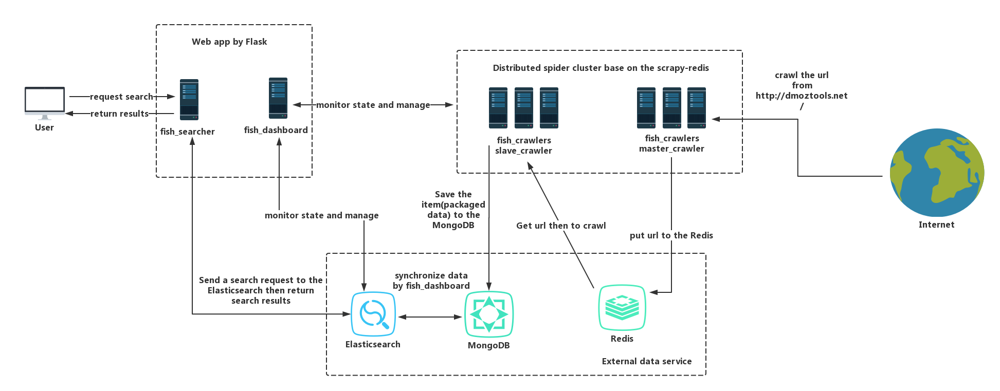

\

.. image:: https://img.shields.io/github/forks/SylvanasSun/FishFishJump.svg?style=social&label=Fork
    :target: https://github.com/SylvanasSun/FishFishJump
.. image:: https://img.shields.io/github/stars/SylvanasSun/FishFishJump.svg?style=social&label=Stars
    :target: https://github.com/SylvanasSun/FishFishJump
.. image:: https://img.shields.io/github/watchers/SylvanasSun/FishFishJump.svg?style=social&label=Watch
    :target: https://github.com/SylvanasSun/FishFishJump
.. image:: https://img.shields.io/github/followers/SylvanasSun.svg?style=social&label=Follow
    :target: https://github.com/SylvanasSun/FishFishJump

\

.. image:: https://img.shields.io/badge/Scrapy-1.4.0-blue.svg
    :target: https://github.com/scrapy/scrapy

.. image:: https://img.shields.io/badge/Flask-0.12.2-blue.svg
    :target: https://github.com/pallets/flask

.. image:: https://img.shields.io/badge/Redis-required-green.svg
    :target: https://redis.io/

.. image:: https://img.shields.io/badge/Elasticsearch-required-green.svg
    :target: https://www.elastic.co/

.. image:: https://img.shields.io/badge/MongoDB-required-green.svg
    :target: https://www.mongodb.com/

.. image:: https://img.shields.io/badge/docker-support-green.svg
    :target: https://www.docker.com/

\

.. image:: https://badges.frapsoft.com/os/mit/mit.svg?v=103)](https://opensource.org/licenses/mit-license.php
    :target: LICENSE

.. image:: https://travis-ci.org/SylvanasSun/FishFishJump.svg?branch=master
    :target: https://travis-ci.org/SylvanasSun/FishFishJump

.. image:: https://img.shields.io/pypi/pyversions/FishFishJump.svg
    :target: https://pypi.python.org/pypi/FishFishJump

.. image:: https://img.shields.io/pypi/v/FishFishJump.svg
    :target: https://pypi.python.org/pypi/FishFishJump

.. image:: https://img.shields.io/badge/version-0.2.3-brightgreen.svg
    :target: HISTORY.rst

.. image:: https://img.shields.io/github/release/SylvanasSun/FishFishJump.svg
    :target: https://github.com/SylvanasSun/FishFishJump

.. image:: https://img.shields.io/github/tag/SylvanasSun/FishFishJump.svg
    :target: https://github.com/SylvanasSun/FishFishJump

.. image:: https://img.shields.io/github/issues/SylvanasSun/FishFishJump.svg
    :target: https://github.com/SylvanasSun/FishFishJump

\

简体中文_

.. _简体中文: README_CH.rst

FishFishJump is a solution that simplifies and basic for search engines and provides multiple demos that are deployed independently through Docker. Examples are included to help implement a customizable search engine site.

- **fish_core**: Include some common utils or components and other modules depend on it.

- **fish_crawlers**: A demo of the distributed crawler that implements base on scrapy-redis, it contains two projects of scrapy, the master_crawler will crawl link from http://dmoztools.net/ and put it to the Redis queue, the slave_crawler will crawl the link from the Redis queue then extract info and store into the MongoDB.

- **fish_dashboard**: A web app for monitoring health status and info of  Scrapy and Elasticsearch base on Flask.

- **fish_searcher**: A web app that supports search and returns search results for the user and it base on the Elasticsearch and depends data on the fish_crawler crawling.

Usage
---------

If you want independent deployments, input the following commands in the root directory of your project (must contain the docker-compose.yml file):

::

    docker-compose up -d --build

For more about docker and docker-compose please refer to: https://docs.docker.com/compose/

Note: for fish_crawlers, you also need to access the Docker container and deploy scrapy, FishFishJump deployment way use Scrapyd, the related configuration file is in the scrapy.cfg such as:

::

    # Automatically created by: scrapy startproject
    #
    # For more information about the [deploy] section see:
    # https://scrapyd.readthedocs.org/en/latest/deploy.html

    [settings]
    default = master_crawler.settings

    [deploy:master_crawler01]
    url = http://127.0.0.1:6800/
    project = master_crawler

Look at the following command to deployments:

::

    # enter inside of the Docker container
    docker exec -it [container id] /bin/bash
    # deploy scrapy project by command 'scrapyd-deploy [deploy name]', the deploy name refers to the file scrapy.cfg
    cd master_crawler
    scrapyd-deploy master_crawler01
    cd ..
    cd slave_crawler
    scrapyd-deploy slave_crawler01
    # start crawlers, project_name and spider_name refer to the file scrapy.cfg
    # The spider dmoz_crwaler must need a list of the Redis and its key is dmoz_crawler:start_urls and value is http://dmoztools.net/
    # Example: redis LPUSH dmoz_crawler:start_urls http://dmoztools.net/
    curl http://localhost:6800/schedule.json -d project=master_crawler -d spider=dmoz_crawler
    curl http://localhost:6800/schedule.json -d project=slave_crawler -d spider=simple_fish_crawler
    # exit from the Docker container
    exit

More about please refer to: https://github.com/scrapy/scrapyd-client

Note: fish_crawlers use Redis and MongoDB through Docker. To disable Redis and MongoDB usage, delete the following content in docker-compose.yml and configure your Redis and MongoDB address in Scrapy project(settings.py).

::

    redis:
        image: redis
        container_name: FishFishJump_Redis
        ports:
            - "6379:6379"

    mongo:
        image: mongo
        container_name: FishFishJump_Mongo
        ports:
            - "27017:27017"

      links:
        - redis
        - mongo

If you do not want to use Docker then you need to manually start fish_crawlers or fish_dashboard by inputting the following commands:

::

    # First we need to install FishFishJump
    pip install FishFishJump
    # if on the root directory of the master_crawler
    scrapy crawl dmoz_crawler
    # if on the root directory of the slave_crawler
    scrapy crawl simple_fish_crawler
    # if on the root directory of the fish_dashboard or fish_searcher
    python app.py

For fish_crawlers you can also use scrapyd for deployments, or remote manage by fish_dashboard.

Dashboard
---------

fish_dashboard is a monitoring platform that monitors health status and information of Scrapy and Elasticsearch. Supports several features such as:

- Real-time data updates are displayed using ajax polling. Can be disabled by setting ``POLLING_INTERVAL_TIME`` to 0.

- Fault alarm mechanism, fish_dashboard will send an email to you when your Scrapy or Elasticsearch returns no response for a long time(reach maximum fault number of times, this param refer to MAX_FAILURE_TIMES in the settings.py).

- Data transfer mechanism, there are two methods of data transfer from MongoDB into the Elasticsearch for generating index databases for searching. The first way is through manual transfer where data is transmitted offline once at one time. The second way is the automatic transfer data based on a thread polling implementation. This thread will always transfer data from MongoDB into the Elasticsearch until disable it.

fish_dashboard is based on a Flask implementation and its config file is in the settings.py in the root directory of the fish_dashboard. You can also use command line interface. The specific configuration is as following:

::

    Usage: fish_dashboard [options] args

    Command line param for FishFishJump webapp.

    Options:
    -h, --help            show this help message and exit
    --host=HOST           host address, default: 0.0.0.0
    --port=PORT           port, default: 5000
    --username=ADMIN_USERNAME
                            administrator username for login, default: admin
    --password=ADMIN_PASSWORD
                            administrator password for login, default: 123456
    -d, --debug           enable debug pattern of the flask, default: True
    -t, --test            enable test pattern of the flask, default: False
    --cached-expire=CACHE_EXPIRE
                            expire of the flask cache, default: 60
    --scrapyd-url=SCRAPYD_URL
                            url of the scrapyd for connect scrapyd service,
                            default: http://localhost:6800/
    -v, --verbose           verbose that log info, default: False
    --log-file-dir=LOG_FILE_DIR
                            the dir path of the where store log file, default:
                            E:\FishFishJump\log\
    --log-file-name=LOG_FILE_BASIS_NAME
                            the name of the what log file, default:
                            fish_fish_jump_webapp.log
    --elasticsearch-hosts=ELASTICSEARCH_HOSTS
                            the string represent a host address for Elasticsearch,
                            format: hostname:port and able to write multiple
                            address by comma separated default: localhost:9200
    --polling-interval=POLLING_INTERVAL_TIME
                            the time of the interval time for real-time dynamic
                            update, units second default: 3
    --failure-sleep-time=FAILURE_SLEEP_TIME
                            if connected fail will turn to this time window and
                            return backup data in this time window, units second
                            default: 30
    --max-failure-times=MAX_FAILURE_TIMES
                            the number of the max failure times if occurred fail
                            reaching the upper limit will sent message into the
                            front-end, default: 5
    --max-failure-message-key=MAX_FAILURE_MESSAGE_KEY
                            the string of the key for message sent after reaching
                            the upper limit, default: timeout_error

Here are some renderings:

.. image:: info/dashboard-01.png
.. image:: info/dashboard-02.png
.. image:: info/dashboard-03.gif
.. image:: info/dashboard-04.gif

Searcher
---------

The fish_searcher is a web app that supports search and returns search results and implementions based on the Elasticsearch. It provides some basic functions that are similar to a search engine site.

.. image:: info/searching.gif

::

    Usage: fish_searcher [options] args

    Command line param for FishFishJump webapp.

    Options:
    -h, --help            show this help message and exit
    --host=HOST           host address, default: 0.0.0.0
    --port=PORT           port, default: 5009
    -d, --debug           enable debug pattern of the flask, default: True
    -t, --test            enable test pattern of the flask, default: False
    -v, --verbose         verbose that log info, default: False
    --log-file-dir=LOG_FILE_DIR
                            the dir path of the where store log file, default:
                            E:\FishFishJump\log\
    --log-file-name=LOG_FILE_BASIS_NAME
                            the name of the what log file, default:
                            fish_fish_jump_searcher.log
    --elasticsearch-hosts=ELASTICSEARCH_HOSTS
                            the string represent a host address for Elasticsearch,
                            format: hostname:port and able to write multiple
                            address by comma separated default: localhost:9200
    --elasticsearch-index=ELASTICSEARCH_INDEX
                            the string represents a list of the index for query
                            data from Elasticsearch, if you want to assign
                            multiple please separate with a comma, for example,
                            index_a,index_b, default: ['pages']
    --elasticsearch-doc-type=ELASTICSEARCH_DOC_TYPE
                            the string represents a list of the doc_type for query
                            data from Elasticsearch, if you want to assign
                            multiple please separate with a comma, for example,
                            doc_type_a, doc_type_b, default: ['page_item']
    --redis-cache           enable Redis for external cache, default: False
    --redis-host=REDIS_HOST
                            the string represents a host of the Redis and the
                            configuration invalid when not set config --redis-
                            cache, default: 127.0.0.1
    --redis-port=REDIS_PORT
                            the string represents a port of the Redis and the
                            configuration invalid when not set config --redis-
                            cache , default: 6379
