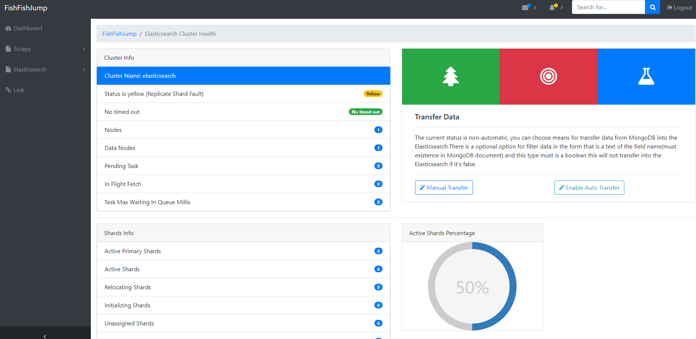
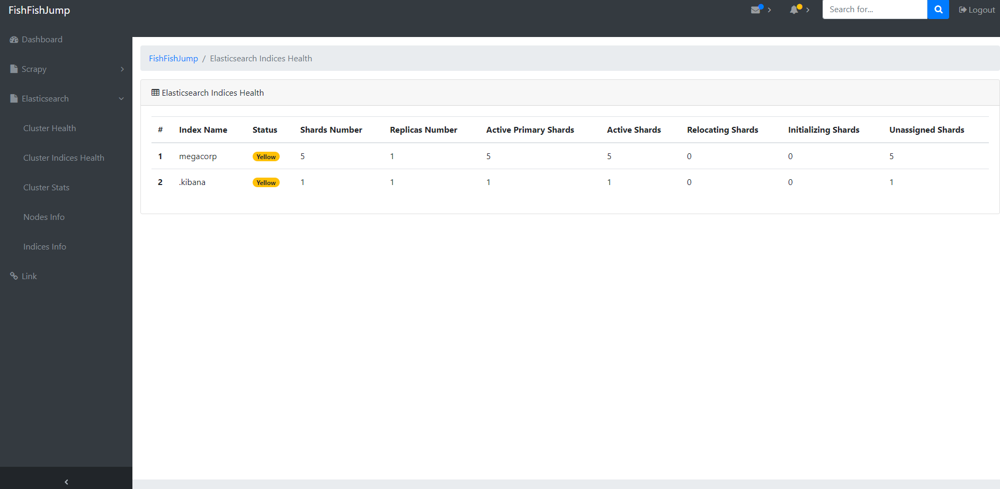
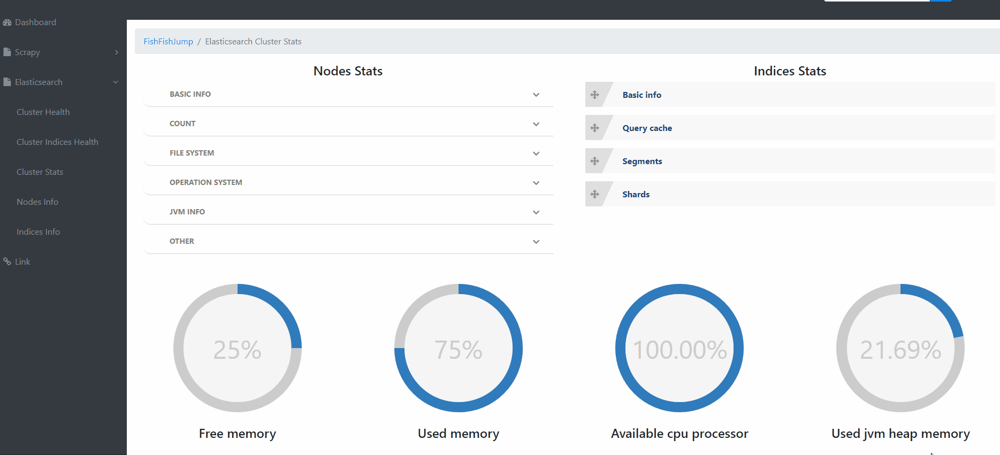
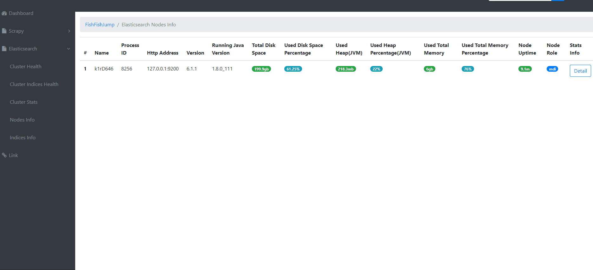

.. image:: https://badges.frapsoft.com/os/mit/mit.svg?v=103)](https://opensource.org/licenses/mit-license.php
    :target: https://pypi.python.org/pypi/FishFishJump
.. image:: https://img.shields.io/pypi/pyversions/Django.svg
    :target: https://pypi.python.org/pypi/FishFishJump
.. image:: https://img.shields.io/pypi/v/nine.svg
    :target: https://pypi.python.org/pypi/FishFishJump

FishFishJump is a solution that simply and basic for search engines and provide multiple demos that independent deployment by used Docker.

- fish_core: Include some common utils or components and other modules depend on it.
- fish_crawlers: A demo of the distributed crawler that implements base on scrapy-redis, it contains two projects of scrapy, the master_crawler will crawl link from http://dmoztools.net/ and put it to the Redis queue, the slave_crawler will crawl the link from the Redis queue then extract info and store into the MongoDB.
- fish_dashboard: A web app for monitoring health status and info of  Scrapy and Elasticsearch base on Flask.

Usage
---------

If you want to independent deployments then you only need input following order in root directory of the fish_crawler or fish_dashboard:

::

    docker-compose up -d

More about docker and docker-compose please refer to: https://docs.docker.com/compose/

Notice: for fish_crawlers, you also need to access the Docker container and deploy scrapy, FishFishJump deployment way use Scrapyd, the related configuration file is in the scrapy.cfg such as:

::

    # Automatically created by: scrapy startproject
    #
    # For more information about the [deploy] section see:
    # https://scrapyd.readthedocs.org/en/latest/deploy.html

    [settings]
    default = master_crawler.settings

    [deploy:master_crawler01]
    url = http://127.0.0.1:6800/
    project = master_crawler

Look at the following command to deployments:

::

    # enter in inside of the Docker container
    docker exec -it [container id] /bin/bash
    # register scrapy (need is in the root directory of the target scrapy project)
    scrapyd-deploy
    # start a crawler
    # project_name and spider_name refer to scrapy.cfg, the following examples are slave_crawler
    curl http://localhost:6800/schedule.json -d project=slave_crawler -d spider=simple_fish_crawler
    # exit from the Docker container
    exit

More about please refer to: https://github.com/scrapy/scrapyd-client

By the way, fish_crawlers use local Redis and MongoDB by Docker. if you don't want to then you can delete the following content in docker-compose.yml and config your Redis and MongoDB address in Scrapy project(settings.py).

::

    redis:
        image: redis
        container_name: FishFishJump_redis
        ports:
            - "6379:6379"

    mongo:
        image: mongo
        container_name: FishFishJump_mongo
        ports:
            - "27017:27017"

      links:
        - redis
        - mongo

if you want not use Docker then you need manual start fish_crawlers or fish_dashboard, please input following order:

::

    # the first need install dependency
    pip install FishFishJump
    # if on the root directory of the master_crawler
    scrapy crawl dmoz_crawler
    # if on the root directory of the slave_crawler
    scrapy crawl simple_fish_crawler
    # if on the root directory of the fish_dashboard
    python app.py

For fish_crawlers you can also use scrapyd for deployments.

Dashboard
---------

